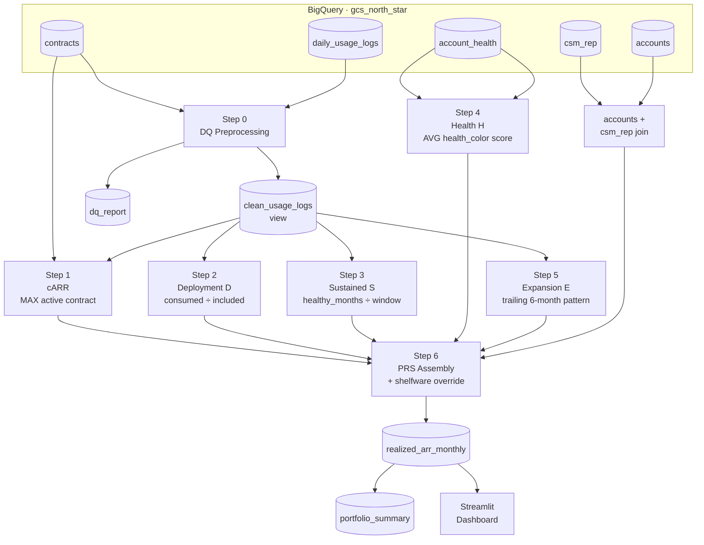

# sys_arch.md — Technical Architecture & Schema Spec
## PANW GCS · Realized ARR Pipeline
**Version:** 2.0  
**Owner:** Principal PM, Centralized Data & AI / Analytics  
**Companion files:** `prd.md`, `test_spec.md`

---

## 1. System Architecture Overview



---

## 2. Source Table Schemas (BigQuery DDL)

```sql
-- TABLE: csm_rep
CREATE TABLE IF NOT EXISTS gcs_north_star.csm_rep (
    csm_id  STRING NOT NULL,
    name    STRING NOT NULL,
    region  STRING NOT NULL,   -- 'North America' | 'EMEA' | 'APAC' | 'LATAM'
    segment STRING NOT NULL    -- 'Enterprise' | 'Mid-Market'
);

-- TABLE: accounts
CREATE TABLE IF NOT EXISTS gcs_north_star.accounts (
    account_id   STRING NOT NULL,
    company_name STRING NOT NULL,
    industry     STRING,        -- e.g. 'Technology', 'Financial Services'
    rep_id       STRING NOT NULL  -- FK → csm_rep.csm_id
);

-- TABLE: contracts
CREATE TABLE IF NOT EXISTS gcs_north_star.contracts (
    contract_id                       STRING  NOT NULL,
    account_id                        STRING  NOT NULL,  -- FK → accounts.account_id
    start_date                        DATE    NOT NULL,
    end_date                          DATE    NOT NULL,
    annual_commit_dollars             INT64   NOT NULL,
    included_monthly_compute_credits  INT64   NOT NULL
);

-- TABLE: account_health
CREATE TABLE IF NOT EXISTS gcs_north_star.account_health (
    health_color             STRING,   -- 'Green' | 'Yellow' | 'Red' | NULL
    account_id               STRING NOT NULL,
    date                     DATE   NOT NULL,
    compute_credits_consumed INT64
);

-- TABLE: daily_usage_logs
CREATE TABLE IF NOT EXISTS gcs_north_star.daily_usage_logs (
    log_id                   STRING NOT NULL,
    account_id               STRING NOT NULL,
    date                     DATE   NOT NULL,
    compute_credits_consumed INT64  NOT NULL
);
```

---

## 3. Step 0 — DQ Preprocessing

**Must run before all metric logic. All downstream steps consume `clean_usage_logs`, never the raw table.**

### clean_usage_logs view

```sql
CREATE OR REPLACE VIEW gcs_north_star.clean_usage_logs AS
SELECT
    l.log_id,
    l.account_id,
    l.date,
    l.compute_credits_consumed
FROM gcs_north_star.daily_usage_logs l
WHERE
    -- DQ-001: exclude orphaned logs
    l.account_id IN (SELECT account_id FROM gcs_north_star.accounts)
    -- DQ-002: exclude rogue usage before contract window
    AND l.date >= DATE('2024-01-01')
    -- DQ-005: exclude negative consumption
    AND l.compute_credits_consumed >= 0;
```

### dq_report table (append on each run)

```sql
CREATE TABLE IF NOT EXISTS gcs_north_star.dq_report (
    run_timestamp  TIMESTAMP NOT NULL,
    log_id         STRING,
    account_id     STRING,
    date           DATE,
    compute_credits_consumed INT64,
    dq_rule        STRING NOT NULL,  -- 'DQ-001' | 'DQ-002' | 'DQ-003' | 'DQ-004' | 'DQ-005'
    exclusion_reason STRING
);
```

### DQ population query (run once per pipeline execution)

```sql
INSERT INTO gcs_north_star.dq_report
SELECT
    CURRENT_TIMESTAMP() AS run_timestamp,
    l.log_id,
    l.account_id,
    l.date,
    l.compute_credits_consumed,
    CASE
        WHEN l.account_id NOT IN (SELECT account_id FROM gcs_north_star.accounts)
             THEN 'DQ-001'
        WHEN l.date < DATE('2024-01-01')
             THEN 'DQ-002'
        WHEN l.compute_credits_consumed < 0
             THEN 'DQ-005'
    END AS dq_rule,
    CASE
        WHEN l.account_id NOT IN (SELECT account_id FROM gcs_north_star.accounts)
             THEN 'Orphaned log: account_id not in accounts table'
        WHEN l.date < DATE('2024-01-01')
             THEN 'Rogue usage: date precedes contract window'
        WHEN l.compute_credits_consumed < 0
             THEN 'Negative consumption: data pipeline error'
    END AS exclusion_reason
FROM gcs_north_star.daily_usage_logs l
WHERE
    l.account_id NOT IN (SELECT account_id FROM gcs_north_star.accounts)
    OR l.date < DATE('2024-01-01')
    OR l.compute_credits_consumed < 0;
```

---

## 4. Pipeline Steps — Exact Logic

All steps operate at **account_id × month** grain.
`target_month` is a DATE truncated to the first of the month (e.g., `2024-01-01`).

---

### Step 1 — Contracted ARR (cARR)

```sql
-- Active contracts: target_month falls between start_date and end_date
-- DQ-003: MAX() resolves overlapping contracts (mid-year expansions)
WITH active_contracts AS (
    SELECT
        account_id,
        MAX(annual_commit_dollars)            AS contracted_arr,
        MAX(included_monthly_compute_credits) AS included_monthly_credits,
        MIN(start_date)                       AS earliest_start
    FROM gcs_north_star.contracts
    WHERE DATE_TRUNC(start_date, MONTH) <= target_month
      AND end_date >= target_month
    GROUP BY account_id
)
```

- `DQ-004` guard: If `included_monthly_credits = 0`, set `deployment_score = NULL` for this account-month and exclude from portfolio averages.

---

### Step 2 — Deployment Score (D)

```sql
WITH monthly_consumption AS (
    SELECT
        account_id,
        SUM(compute_credits_consumed) AS monthly_consumed
    FROM gcs_north_star.clean_usage_logs
    WHERE DATE_TRUNC(date, MONTH) = target_month
    GROUP BY account_id
),
deployment AS (
    SELECT
        a.account_id,
        ROUND(
            LEAST(1.0,
                COALESCE(c.monthly_consumed, 0.0) /
                NULLIF(a.included_monthly_credits, 0)
            ), 4
        ) AS deployment_score,
        COALESCE(c.monthly_consumed, 0.0) > a.included_monthly_credits AS flag_overage
    FROM active_contracts a
    LEFT JOIN monthly_consumption c USING (account_id)
)
```

---

### Step 3 — Sustained Usage Score (S)

```sql
-- Window: MIN(months since contract start, 12)
-- healthy_month: monthly_consumption >= 0.30 × included_monthly_credits
WITH trailing_usage AS (
    SELECT
        account_id,
        DATE_TRUNC(date, MONTH)           AS usage_month,
        SUM(compute_credits_consumed)     AS monthly_consumed
    FROM gcs_north_star.clean_usage_logs
    WHERE DATE_TRUNC(date, MONTH) BETWEEN
          DATE_SUB(target_month, INTERVAL 11 MONTH)
          AND target_month
    GROUP BY account_id, DATE_TRUNC(date, MONTH)
),
sustained AS (
    SELECT
        t.account_id,
        COUNT(t.usage_month)              AS months_in_window,
        COUNTIF(t.monthly_consumed >= 0.30 * a.included_monthly_credits)
                                          AS healthy_months,
        ROUND(
            SAFE_DIVIDE(
                COUNTIF(t.monthly_consumed >= 0.30 * a.included_monthly_credits),
                -- window capped at MIN(months_active, 12)
                LEAST(
                    DATE_DIFF(target_month, a.earliest_start, MONTH) + 1,
                    12
                )
            ), 4
        ) AS sustained_usage_score
    FROM trailing_usage t
    JOIN active_contracts a USING (account_id)
    GROUP BY t.account_id, a.included_monthly_credits, a.earliest_start
)
```

---

### Step 4 — Technical Health Score (H)

```sql
-- AVG health score for all Account_Health records in the target month
-- Missing → 0.60 (neutral default, not a penalty)
WITH health_scores AS (
    SELECT
        account_id,
        ROUND(AVG(
            CASE health_color
                WHEN 'Green'  THEN 1.00
                WHEN 'Yellow' THEN 0.60
                WHEN 'Red'    THEN 0.20
                ELSE               0.60   -- Missing → neutral
            END
        ), 4) AS technical_health_score
    FROM gcs_north_star.account_health
    WHERE DATE_TRUNC(date, MONTH) = target_month
    GROUP BY account_id
)
-- Accounts with no health records in target_month receive 0.60 via LEFT JOIN + COALESCE
```

---

### Step 5 — Expansion Momentum (E)

```sql
-- Guard: accounts with < 3 months active → 0.10 (new account default)
-- Window: trailing 6 months for qualifying condition check
WITH t6_usage AS (
    SELECT
        account_id,
        DATE_TRUNC(date, MONTH)       AS usage_month,
        SUM(compute_credits_consumed) AS monthly_consumed
    FROM gcs_north_star.clean_usage_logs
    WHERE DATE_TRUNC(date, MONTH) BETWEEN
          DATE_SUB(target_month, INTERVAL 5 MONTH)
          AND target_month
    GROUP BY account_id, DATE_TRUNC(date, MONTH)
),
expansion AS (
    SELECT
        t.account_id,
        CASE
            -- New account guard
            WHEN DATE_DIFF(target_month, a.earliest_start, MONTH) < 3
                THEN 0.10
            -- 3+ months in trailing 6 at 120%+
            WHEN COUNTIF(t.monthly_consumed >= 1.20 * a.included_monthly_credits) >= 3
                THEN 1.00
            -- 3+ months in trailing 6 at 70%+
            WHEN COUNTIF(t.monthly_consumed >= 0.70 * a.included_monthly_credits) >= 3
                THEN 0.70
            -- 3+ months in trailing 6 at 30%+
            WHEN COUNTIF(t.monthly_consumed >= 0.30 * a.included_monthly_credits) >= 3
                THEN 0.40
            ELSE 0.10
        END AS expansion_momentum
    FROM t6_usage t
    JOIN active_contracts a USING (account_id)
    GROUP BY t.account_id, a.included_monthly_credits, a.earliest_start
)
```

---

### Step 6 — PRS Assembly + Shelfware Override + Realized ARR

```sql
SELECT
    ac.account_id,
    target_month                                        AS month,
    ac.contracted_arr,
    COALESCE(d.deployment_score,   0.0)                 AS deployment_score,
    COALESCE(s.sustained_usage_score, 0.0)              AS sustained_usage_score,
    COALESCE(h.technical_health_score, 0.60)            AS technical_health_score,
    COALESCE(e.expansion_momentum, 0.10)                AS expansion_momentum,

    -- Shelfware override (INV-003): if D=0 AND S=0, PRS must be 0.0
    CASE
        WHEN COALESCE(d.deployment_score, 0.0) = 0.0
         AND COALESCE(s.sustained_usage_score, 0.0) = 0.0
        THEN 0.0
        ELSE ROUND(
            COALESCE(d.deployment_score,      0.0) * 0.40
          + COALESCE(s.sustained_usage_score, 0.0) * 0.30
          + COALESCE(h.technical_health_score, 0.60) * 0.20
          + COALESCE(e.expansion_momentum,    0.10) * 0.10,
        4)
    END                                                  AS prs,

    -- Realized ARR
    ROUND(ac.contracted_arr *
        CASE
            WHEN COALESCE(d.deployment_score, 0.0) = 0.0
             AND COALESCE(s.sustained_usage_score, 0.0) = 0.0
            THEN 0.0
            ELSE COALESCE(d.deployment_score,      0.0) * 0.40
               + COALESCE(s.sustained_usage_score, 0.0) * 0.30
               + COALESCE(h.technical_health_score, 0.60) * 0.20
               + COALESCE(e.expansion_momentum,    0.10) * 0.10
        END,
    2)                                                   AS realized_arr,

    -- Health band
    CASE
        WHEN prs >= 0.80 THEN 'Green'
        WHEN prs >= 0.60 THEN 'Yellow'
        WHEN prs >= 0.30 THEN 'Orange'
        ELSE 'Red'
    END                                                  AS prs_band,

    -- Flags
    COALESCE(d.deployment_score, 0.0) = 0.0
      AND COALESCE(s.sustained_usage_score, 0.0) = 0.0  AS shelfware_override,
    COALESCE(d.flag_overage, FALSE)                      AS flag_overage,
    COALESCE(s.months_in_window, 0)                      AS months_in_window,

    -- Account metadata (for dashboard filtering)
    acc.rep_id,
    rep.name    AS rep_name,
    rep.region,
    rep.segment,
    acc.industry

FROM active_contracts ac
LEFT JOIN deployment     d USING (account_id)
LEFT JOIN sustained      s USING (account_id)
LEFT JOIN health_scores  h USING (account_id)
LEFT JOIN expansion      e USING (account_id)
JOIN      gcs_north_star.accounts  acc USING (account_id)
JOIN      gcs_north_star.csm_rep   rep ON acc.rep_id = rep.csm_id
```

---

## 5. Output Table Schemas

### gcs_north_star.realized_arr_monthly

```sql
CREATE TABLE IF NOT EXISTS gcs_north_star.realized_arr_monthly (
    account_id               STRING    NOT NULL,
    month                    DATE      NOT NULL,  -- first of month, e.g. 2024-01-01
    contracted_arr           INT64     NOT NULL,
    deployment_score         NUMERIC   NOT NULL,  -- 0.0000 to 1.0000
    sustained_usage_score    NUMERIC   NOT NULL,
    technical_health_score   NUMERIC   NOT NULL,
    expansion_momentum       NUMERIC   NOT NULL,
    prs                      NUMERIC   NOT NULL,  -- 0.0000 to 1.0000
    realized_arr             NUMERIC   NOT NULL,  -- 0.00 to contracted_arr
    prs_band                 STRING    NOT NULL,  -- Green | Yellow | Orange | Red
    shelfware_override       BOOL      NOT NULL,
    flag_overage             BOOL      NOT NULL,
    months_in_window         INT64     NOT NULL,
    rep_id                   STRING    NOT NULL,
    rep_name                 STRING    NOT NULL,
    region                   STRING    NOT NULL,
    segment                  STRING    NOT NULL,
    industry                 STRING
)
PARTITION BY month
CLUSTER BY region, segment, prs_band;
```

### gcs_north_star.portfolio_summary

```sql
CREATE TABLE IF NOT EXISTS gcs_north_star.portfolio_summary (
    month                    DATE      NOT NULL,
    total_contracted_arr     INT64     NOT NULL,
    total_realized_arr       NUMERIC   NOT NULL,
    unrealized_gap           NUMERIC   NOT NULL,  -- total_contracted - total_realized
    portfolio_prs            NUMERIC   NOT NULL,  -- ARR-weighted average PRS
    realization_rate_pct     NUMERIC   NOT NULL,  -- 0.00 to 100.00

    -- Tier counts + ARR
    green_accounts           INT64,
    green_arr                NUMERIC,
    yellow_accounts          INT64,
    yellow_arr               NUMERIC,
    orange_accounts          INT64,
    orange_arr               NUMERIC,
    red_accounts             INT64,
    red_arr                  NUMERIC,

    -- Edge case counts
    shelfware_accounts       INT64,
    shelfware_arr            NUMERIC,
    overage_accounts         INT64,
    overage_arr              NUMERIC,

    -- DQ counts for the run
    dq_001_orphaned_count    INT64,
    dq_002_rogue_count       INT64
)
PARTITION BY month;
```

---

## 6. Edge Case Handling Map

| Edge case | Detection | D behavior | S behavior | PRS behavior | Flag |
|-----------|-----------|-----------|-----------|-------------|------|
| Shelfware | D=0, S=0 | D = 0.00 | S = 0.00 | Override → 0.00 | `shelfware_override = TRUE` |
| Spike & Drop | D > 0 month 1, near-zero after | D may be ok annually | S → 0.08 (1/12 healthy) | PRS penalized by S | — |
| Consistent Overager | Monthly consume > 1.2× included | D = 1.00 (capped) | S = 1.00 | E = 1.00, PRS near 1.0 | `flag_overage = TRUE` |
| Mid-year expansion | 2 active contracts same period | MAX(included) used for D | Longer history used | Higher cARR captured | — |
| Orphaned log | account_id not in accounts | Excluded from D | Excluded from S | No impact | DQ-001 in dq_report |
| Rogue usage | date before contract window | Excluded from D | Excluded from S | No impact | DQ-002 in dq_report |

---

## 7. Engineering Conventions

```
LANG-001: Python 3.11+. All functions must have type hints (PEP 484).
LANG-002: Google-style docstrings on all functions and classes.
LANG-003: Modular, stateless functions. No global mutable state.
LANG-004: Use google-cloud-bigquery Python client. Never use pandas-gbq.
LANG-005: Pipeline must be idempotent. Running twice produces same output.
           Use WRITE_TRUNCATE on realized_arr_monthly.
LANG-006: All SQL must be parameterized. No string interpolation for dates.
LANG-007: Environment variables for project_id and dataset_id.
           Never hardcode project IDs in source files.
LANG-008: Logging: use Python logging module. Log row counts at each step.
LANG-009: All monetary values stored as NUMERIC (not FLOAT64) to avoid rounding.
LANG-010: Write unit tests for each component function in tests/ directory.
```

---

## 8. Performance Requirements

```
PERF-001: Full 12-month pipeline (1,000 accounts) must complete in < 60 seconds
PERF-002: Single-month run must complete in < 10 seconds
PERF-003: Dashboard P95 load time < 3 seconds on cached data (st.cache_data ttl=600)
PERF-004: BigQuery slot usage must stay within sandbox free tier (1TB/month queries)
          Use PARTITION PRUNING on month column in all queries
```

---

## 9. Environment Variables

```bash
# Required
export BIGQUERY_PROJECT_ID="your-gcp-project-id"
export BIGQUERY_DATASET_ID="gcs_north_star"

# Optional (for Streamlit dashboard)
export STREAMLIT_PORT=8501
export DASHBOARD_CACHE_TTL=600
```

---

## 10. File Structure

```
panw-gcs-northstar/
├── specs/
│   ├── prd.md              ← product rules (this files companion)
│   ├── sys_arch.md         ← THIS FILE
│   └── test_spec.md        ← verification tests
├── sql/
│   ├── 00_dq_view.sql      ← clean_usage_logs view + dq_report insert
│   ├── 01_realized_arr.sql ← main pipeline query (Steps 1-6)
│   └── 02_portfolio.sql    ← portfolio_summary aggregation
├── pipeline/
│   ├── __init__.py
│   ├── dq.py               ← Step 0 DQ functions
│   ├── components.py       ← D, S, H, E computation functions
│   ├── prs.py              ← PRS assembly + shelfware override
│   └── run_pipeline.py     ← main entry point
├── tests/
│   ├── test_dq.py
│   ├── test_components.py
│   └── test_prs.py
├── dashboard.py            ← Streamlit app
├── generate_dataset.py
└── requirements.txt
```
