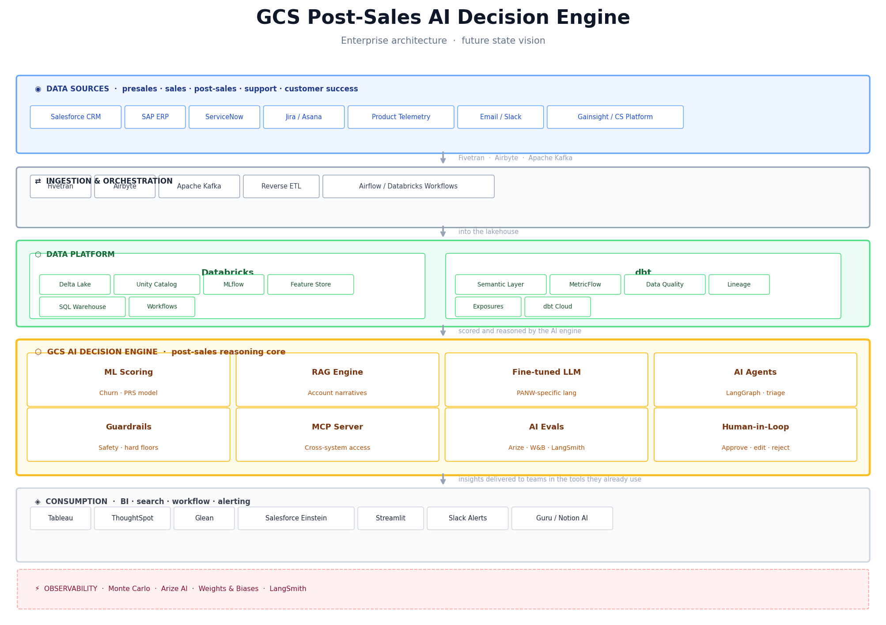
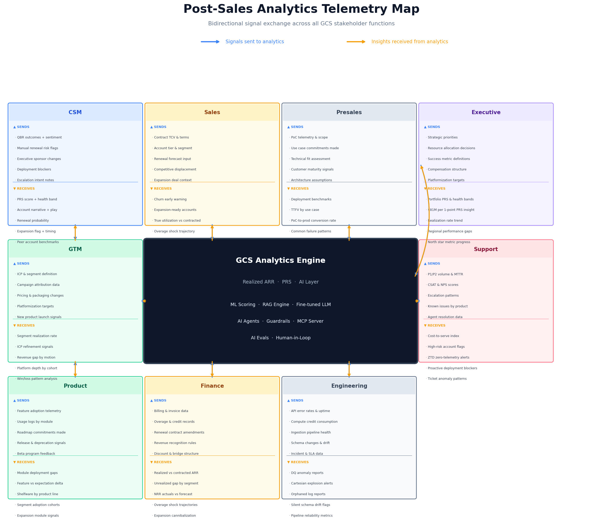

# AI-Native Post-Sales Decision Intelligence
## A Future State Vision for Enterprise Customer Success Analytics

---

> **Author:** Dharmesh Bhagat — Principal PM, AI Analytics & Post-Sales Intelligence  
> **Version:** 1.0  
> **Status:** Future State Vision  
> **Published:** June 2026  
> **Repository:** [github.com/DharmeshBhagat/panw-gcs-northstar](https://github.com/DharmeshBhagat/panw-gcs-northstar)

---

## Table of Contents

1. [Executive Summary](#1-executive-summary)
2. [The Problem: From Reporting to Decision Intelligence](#2-the-problem)
3. [The North Star Metric: Realized ARR](#3-the-north-star-metric-realized-arr)
4. [Vision: The GCS AI Decision Engine](#4-vision-the-gcs-ai-decision-engine)
5. [Core AI Technology Concepts Applied](#5-core-ai-technology-concepts-applied)
6. [The Enterprise Telemetry Map](#6-the-enterprise-telemetry-map)
7. [The AI MVP: Where to Start](#7-the-ai-mvp-where-to-start)
8. [Implementation Roadmap](#8-implementation-roadmap)
9. [Conclusion](#9-conclusion)

---

## 1. Executive Summary

Enterprise post-sales teams are sitting on one of the most valuable and underutilized data assets in the company: the full operational record of whether customers are actually getting value from the products they purchased.

This paper describes a future state architecture — the **GCS AI Decision Engine** — that transforms post-sales analytics from a passive reporting function into an active, AI-powered decision system. It is organized around two core concepts:

**Concept 1 — The GCS AI Decision Engine:** A six-layer enterprise architecture that connects data from Sales, Support, Product, Engineering, Finance, and Customer Success into a unified AI reasoning core. The engine does not just compute metrics — it explains them, predicts their trajectory, and triggers action through AI agents connected via Model Context Protocol (MCP) to the tools CSMs and leaders already use.

**Concept 2 — The Enterprise Telemetry Map:** A structured mapping of what signals each stakeholder function sends *to* the analytics engine and what insights each function receives *from* it. This bidirectional exchange — covering nine teams from Presales to Executive Leadership — is what makes the system an operating nervous system for the entire customer lifecycle, not just a post-sale dashboard.

The vision is grounded in a reference implementation built for Palo Alto Networks Global Customer Services (GCS), where every 1-point improvement in the North Star metric — Platform Realization Score (PRS) — represents approximately $81M in recovered or protected ARR at the company's current NGS ARR scale.

---

## 2. The Problem: From Reporting to Decision Intelligence

### 2.1 The Strategic Shift in Enterprise Software

The economics of enterprise software have permanently changed. The old model rewarded bookings: close the deal, recognize the contract value, repeat. The new model — subscription, platformization, land-and-expand — rewards *realized* value. A $3M contract booked on Day 1 is worth $0 at renewal if the customer never deployed the product.

This shift creates a measurement problem that most post-sales organizations have not yet solved. The metrics they use — NRR, Customer Health Score, CSAT — were designed for the old world. They are lagging, qualitative, or disconnected from revenue. They tell you what happened. They do not tell you what is about to happen, or what to do about it.

### 2.2 The Post-Sales Analytics Gap

In most enterprise companies, post-sales analytics exhibits three structural failures:

| Failure Mode | Symptom | Business Impact |
|---|---|---|
| **Metric lag** | NRR reports churn 12 months after it began | CS teams act too late, renewals are already lost |
| **Signal silos** | Support, CS, and Product see different views of the same account | No unified health picture; contradictory recommendations |
| **Insight-to-action gap** | Dashboards show what is wrong, not what to do | Analysts produce reports; CSMs make decisions without them |

The result is predictable: reactive post-sales organizations that learn about risk at the renewal conversation, not 90 days before it.

### 2.3 The Opportunity

An AI-native post-sales decision system eliminates all three failures:

- **Metric lag** → replaced by a leading PRS score computed monthly with early warning signals
- **Signal silos** → replaced by a unified lakehouse joining all five data domains
- **Insight-to-action gap** → replaced by AI agents that generate recommended plays, draft communications, and route accounts to the right CSM action automatically

> **The core claim:** Post-sales analytics should not produce reports for people to read. It should produce decisions for people to approve.

---

## 3. The North Star Metric: Realized ARR

### 3.1 Why a New Metric is Necessary

Standard SaaS metrics fail in the context of a cybersecurity platform company:

- **NRR** measures what happened at renewal. It has a 12-month lag and no early warning signal.
- **Customer Health Score** is qualitative, CSM-inflatable, and not tied to revenue.
- **Credit Burn Velocity** is a useful secondary signal but captures only one dimension of value realization.
- **CSAT/NPS** measures sentiment, not security coverage or deployment depth.

None of these answers the executive question that actually matters: *Is the customer getting value from what they purchased, and is that value at risk?*

### 3.2 The Formula

```
Realized ARR = Contracted ARR × PRS

PRS (Platform Realization Score) =
    (Deployment Score       × 0.40)
  + (Sustained Usage Score  × 0.30)
  + (Technical Health Score × 0.20)
  + (Expansion Momentum     × 0.10)

OVERRIDE:
  IF Deployment Score = 0 AND Sustained Usage Score = 0
  THEN PRS = 0.00   ← shelfware hard floor
```

### 3.3 Component Design Rationale

| Component | Weight | Business Question Answered | Key Design Decision |
|---|---|---|---|
| **Deployment Score** | 40% | Are they using what they purchased? | `MIN(1.0, consumed/committed)` — capped so overages don't inflate beyond contracted value |
| **Sustained Usage Score** | 30% | Is usage consistent or a one-time spike? | Trailing 12-month window; 30% monthly threshold defines a "healthy month" |
| **Technical Health Score** | 20% | Is the platform technically stable? | Missing records default to 0.60 (Yellow), not penalized at 0.20 (Red) |
| **Expansion Momentum** | 10% | Is this account growing or stalling? | New accounts (<3 months) default to 0.10; trailing 6-month MoM trend |

### 3.4 The Shelfware Hard Floor

The most important design decision in the formula is the shelfware override. In productivity SaaS, unutilized software is wasted budget. In cybersecurity, unutilized software is an **unprotected attack surface**. A customer that purchased a security platform but never deployed it believes they are protected when they are not.

No partial credit. No phantom realized value. If Deployment = 0 and Sustained Usage = 0, Realized ARR = $0, regardless of what the contract says.

### 3.5 The Business Scale Implication

At $8.1B NGS ARR (Palo Alto Networks Q3 FY26):

> **Every 1-point improvement in portfolio PRS ≈ $81M in recovered or protected ARR.**

This single number transforms the metric from a CS tool into a board-level business lever.

---

## 4. Vision: The GCS AI Decision Engine

### 4.1 Architecture Overview

The GCS AI Decision Engine is a six-layer architecture that transforms raw signals from every enterprise system into AI-powered decisions delivered through the tools teams already use.

---



*Figure 1: GCS AI Decision Engine — six-layer enterprise architecture from data sources through AI reasoning core to consumption tools, with observability running across all layers.*

---

The six layers are described in detail below.


### 4.2 Layer 1: Data Sources

The engine requires five categories of data, each answering a distinct question:

| Data Domain | Systems | Business Question |
|---|---|---|
| **Contract & commercial** | Salesforce, SAP | What did the customer commit to pay? |
| **Usage & telemetry** | Product platform, billing | Are they consuming what they purchased? |
| **Technical health** | ServiceNow, platform APIs | Is the platform operating correctly? |
| **Customer engagement** | Gainsight, Jira, email | Are humans actively engaged? |
| **Expansion signals** | CRM, usage trends | Is this account growing or stalling? |

### 4.3 Layer 2: Ingestion & Orchestration

**Fivetran** handles batch ingestion from Salesforce, SAP, and ServiceNow — systems with well-maintained connectors where near-real-time is not required.

**Airbyte** handles custom or open-source connectors for product telemetry and CS platforms where pre-built connectors do not exist.

**Apache Kafka** handles streaming events: usage log ingestion, real-time overage detection, and zero-telemetry-day (ZTD) alerting where latency matters.

**Reverse ETL** pushes AI-generated insights back into Salesforce (PRS score on the account object, health band on the opportunity record) so CSMs see the intelligence in the tools they already live in — not in a new dashboard they have to remember to open.

### 4.4 Layer 3: Data Platform

**Databricks** is the lakehouse foundation. The choice of Databricks over a traditional warehouse is deliberate:

- **Delta Lake** provides ACID transactions on usage log ingestion, preventing the partial-write corruption that silently invalidates PRS scores during pipeline failures.
- **Unity Catalog** provides cross-system account_id lineage and access control — critical when joining Salesforce contract data with product telemetry from a different system.
- **MLflow** tracks PRS model experiments, enabling side-by-side comparison of formula iterations against historical renewal outcomes.
- **Feature Store** provides consistent feature computation across training (ML model) and serving (real-time scoring), eliminating training-serving skew.

**dbt** provides the semantic layer. The `realized_arr` and `prs_band` metrics are defined once in MetricFlow and consumed identically by Tableau, ThoughtSpot, Glean, and Streamlit. No more "why does my number differ across tools?"

### 4.5 Layer 4: The AI Engine Core

This is the reasoning core — the layer that transforms metric computation into decision intelligence. Each sub-system is described in detail in [Section 5](#5-core-ai-technology-concepts-applied).

### 4.6 Layer 5: Consumption

The most important design principle in this layer: **meet teams in the tools they already use.**

| Audience | Primary Tool | Use Case |
|---|---|---|
| Executive Leadership | Tableau / ThoughtSpot | Portfolio health, QBR prep, board reporting |
| CS Leadership | Tableau | Team performance, PRS band distribution |
| CSMs | Streamlit + Slack | Account narratives, at-risk alerts, recommended plays |
| Analytics | Databricks / dbt | Model iteration, signal exploration |
| Sales / AE | Salesforce Einstein | Renewal risk, expansion flags in CRM |
| Cross-functional | Glean | Natural language search across all signals |

---

## 5. Core AI Technology Concepts Applied

### 5.1 ML / AI — Replace Fixed Weights with Learned Weights

**Current state:** The 40/30/20/10 PRS component weights are defensible through first-principles reasoning but are not empirically validated against actual renewal outcomes.

**Future state:** Train a gradient-boosted or logistic regression model on historical PANW renewal and churn data. Let the model learn the actual predictive weight of each component against the ground truth of "did this account renew at full value?"

The hypothesis is that Sustained Usage Score is more predictive of renewal than Deployment Score in the 90-day pre-renewal window — the opposite of the current weighting. A trained model surfaces this empirically. Unsupervised clustering also enables account behavioral archetypes beyond PRS bands: "fast deployer who stalled," "spike-and-recover," "silent shelfware," "consistent over-consumer."

**Key requirement:** A shadow period where both the current formula and the trained model run in parallel, with outcomes tracked, before any compensation implications are switched.

### 5.2 RAG — Ground Every Insight in Actual Account Data

**Current state:** Account narratives are template-driven or non-existent.

**Future state:** When a CSM asks "why is this account at risk?", the system retrieves the actual account's usage logs, ticket history, contract terms, and CS playbooks from a vector store, then generates a response grounded in those specific documents.

The retrieval layer also surfaces **similar accounts that recovered** from the same pattern: *"Three accounts in the same PRS band last quarter recovered when Professional Services ran an emergency pipeline configuration session. Here is what they did."* This is not a recommendation the LLM invented — it is retrieved from historical CS play outcomes.

**Hallucination prevention:** Every sentence in a RAG-generated account narrative must cite a retrieved data point. Any claim that cannot be traced to the account's actual data record is flagged and not rendered for the CSM.

### 5.3 Prompt Engineering — Structure the Reasoning Before the Answer

Two patterns that matter specifically for post-sales account intelligence:

**Chain-of-thought prompting** for account diagnosis forces the model to reason through each PRS component before synthesizing a recommendation, rather than jumping to a conclusion. This reduces confident-but-wrong outputs.

**Few-shot prompting** provides typed account archetypes as examples: what a correct diagnosis looks like for a shelfware account, a spike-and-drop account, and a healthy-but-stalling account. New accounts pattern-match against these exemplars with much higher reliability than zero-shot prompting.

Structured output is always generated first — a validated JSON object containing `account_id`, `risk_type`, `data_points`, `recommended_action`, and `confidence_score` — before any natural language prose is rendered. The structure is the source of truth; the prose is the explanation.

### 5.4 Fine-Tuning — Make the Language Layer Platform-Specific

A base LLM has no knowledge of Cortex XSIAM log pipeline architecture, Prisma SASE deployment patterns, or GCS playbook language.

Fine-tuning on a PANW-specific corpus — CS playbook documents, historical successful CSM interventions, product documentation for Cortex/Prisma/SASE, and support ticket resolution patterns — produces recommendations that say:

> *"Reactivate the Cortex XSIAM log ingestion pipeline via the Data Onboarding wizard — this account's ZTD pattern matches three accounts that recovered via this play last quarter."*

rather than:

> *"Consider reviewing your platform configuration."*

The first sentence is something a CSM acts on. The second is noise.

### 5.5 AI Agents & Workflow Automation — Act on the Insights

**Current state:** The dashboard shows risk. A human decides what to do.

**Future state:** An orchestrator agent monitors the portfolio and routes accounts to specialist agents based on PRS band, pattern type, and urgency:

```
Portfolio pipeline runs
    ↓
Orchestrator agent classifies accounts by action type
    ↓
┌─────────────────────┬──────────────────────┬─────────────────────┐
│  CSM Triage Agent   │  Escalation Agent    │  Expansion Agent    │
│  Drafts narrative   │  Escalates if CSM    │  Flags upsell if    │
│  + Slack message    │  last touch >21 days │  PRS Green + overage│
│  for CSM review     │  to CS Manager       │  for AE review      │
└─────────────────────┴──────────────────────┴─────────────────────┘
    ↓
Human reviews and approves before anything reaches the customer
```

Human-in-the-loop is **built into the workflow architecture**, not bolted on afterward. No agent output reaches a customer-facing communication without explicit human approval.

### 5.6 Guardrails & Safety — Protect Metric and Workflow Integrity

Four guardrail categories are non-negotiable:

**Hard metric rules:** The shelfware floor (PRS = 0.00 when Deployment = 0 AND Sustained Usage = 0) is encoded as an unoverridable constraint. No agent reasoning can produce non-zero Realized ARR for a shelfware account.

**Citation-backed outputs:** Every claim in an AI-generated narrative must trace to a retrieved data record. The system maintains a `data_points` array in the structured output; prose claims without a matching data point are suppressed.

**Confidence thresholds:** If model confidence falls below a threshold (e.g. fewer than 3 months of account history, or conflicting signals), the output routes to a human analyst rather than generating a potentially wrong recommendation with high apparent confidence.

**Human gate before customer contact:** Any output that is customer-facing — a CSM email draft, an executive escalation brief — requires explicit human approval before send. Agents draft; humans ship.

### 5.7 MCP — Connect the AI Engine to Live Systems

Model Context Protocol (MCP) exposes the GCS data layer as a server, making the AI engine accessible from any connected tool:

- CSMs query account health from Slack: *"What is the PRS for Herrera Group this month?"*
- The orchestrator agent reads from and writes to Salesforce: updates account health fields, logs CSM activities, creates tasks
- BigQuery, the CS platform, and Slack become nodes in the same agent workflow rather than separate tools requiring custom integrations

MCP is what makes the AI layer **operational** rather than just analytical. Without it, insights live in a dashboard nobody opens. With it, insights reach CSMs in the tools they already live in.

### 5.8 AI Evals — Measure Whether It Is Working

Four evaluation dimensions define system quality:

| Eval Dimension | What It Measures | Target |
|---|---|---|
| **Recommendation quality** | Does the AI recommendation match what an experienced CSM would suggest? | Requires golden dataset of human-judged cases |
| **Hallucination rate** | What % of narrative claims cannot be traced to retrieved data? | 0% |
| **Outcome correlation** | Do accounts that received AI-recommended interventions show better PRS improvement? | Requires 90-day shadow period |
| **Coverage recall** | What % of accounts that eventually churned were flagged at-risk by the system in advance? | Target: >60% flagged >45 days before event |

---

## 6. The Enterprise Telemetry Map

The AI Decision Engine is only as good as the signals it receives. This section maps what each stakeholder function contributes to the engine and what it receives in return — the full bidirectional telemetry exchange that makes this a post-sales operating system, not just a CS dashboard.

---



*Figure 2: Post-Sales Analytics Telemetry Map — nine stakeholder functions showing signals sent to the GCS Analytics Engine (blue) and insights received from it (amber). The hub-and-spoke architecture makes Analytics the single source of truth for all post-sales intelligence.*

---



```mermaid
graph TD
  A[GCS Analytics Engine] -->|PRS Score + Narrative| B[CSM / Customer Success]
  A -->|Churn Warning + Expansion Signals| C[Sales / AE]
  A -->|Deployment Benchmarks + TTFV| D[Presales / SE]
  A -->|Segment Realization Rate| E[GTM / Strategy]
  A -->|Cost-to-Serve Index + ZTD Alerts| F[Support]
  A -->|Module Deployment Gaps| G[Product]
  A -->|DQ Anomaly Reports| H[Engineering / Platform]
  A -->|Realized vs Contracted ARR| I[Finance]
  A -->|Portfolio Health + North Star Progress| J[Executive]

  B -->|QBR Outcomes + Renewal Risk Flags| A
  C -->|Contract Data + Expansion Context| A
  D -->|PoC Telemetry + Use Case Commitments| A
  E -->|ICP Definition + Campaign Attribution| A
  F -->|P1/P2 Volume + MTTR + CSAT| A
  G -->|Feature Adoption + Usage Logs| A
  H -->|API Health + Schema Changes| A
  I -->|Billing + Revenue Recognition Rules| A
  J -->|Strategic Priorities + Comp Structure| A
```

### 6.1 CSM / Customer Success

**Sends to analytics:**
- QBR outcomes and account sentiment notes
- Manual renewal risk flags (human judgment layer on top of model scores)
- Executive sponsor changes (a leading churn signal weeks before usage drops)
- Deployment blockers logged during onboarding
- Escalation intent notes

**Receives from analytics:**
- PRS score and health band with component breakdown
- AI-generated account narrative with recommended next play
- Renewal probability score with threshold-triggered alerts
- Expansion flag with timing signal (overage trend + healthy usage = upsell ready)
- Peer account benchmarks (accounts in the same PRS band that recovered)

> **The CSM telemetry loop is the highest-value exchange in the system.** CSMs hold unstructured intelligence — conversation tone, sponsor changes, political dynamics — that no data pipeline captures. Analytics holds structured intelligence that no CSM has time to synthesize across 50 accounts. The combination is what makes the AI narrative actionable.

### 6.2 Sales / Account Executive

**Sends to analytics:**
- Contract TCV and terms (the baseline for Contracted ARR)
- Account tier, segment, and competitive displacement context
- Renewal forecast input (human overlay on model probability)
- Expansion deal context (timing, product, negotiation stage)

**Receives from analytics:**
- Churn early warning with enough lead time for conversation (target: 90 days)
- Expansion-ready account list with signals that define readiness
- True utilization versus contracted (the "shelfware conversation" data)
- Overage shock trajectory (accounts approaching commitment exhaustion before renewal)
- Revenue at risk by book of business

### 6.3 Presales / Solution Engineer

**Sends to analytics:**
- PoC telemetry and evaluation scope (what was tested, what succeeded)
- Use case commitments made during evaluation (the success criteria the customer expects)
- Technical fit assessment (architecture assumptions that may become deployment blockers)
- Customer IT maturity signals (change-control process, infosec review cadence)

**Receives from analytics:**
- Deployment success benchmarks by use case (what "good" looks like for this product in this industry)
- Time-to-First-Value benchmarks (helps SEs set accurate expectations during presales)
- PoC-to-production conversion rate by use case type
- Common post-deployment failure patterns (feeds back into presales qualification)

> **The Presales → Analytics signal is the most underutilized in most companies.** SEs capture technical fit, architecture assumptions, and use case commitments during evaluation — and this data almost never makes it into the post-sale health model. Accounts where presales assumptions did not match the actual deployment environment are high-risk from Day 1, not after the first renewal conversation.

### 6.4 GTM / Strategy

**Sends to analytics:**
- ICP definition and segment data (what a healthy target customer looks like)
- Campaign attribution data (which GTM motion produced the account)
- Pricing and packaging changes (affects PRS score interpretation for cohorts)
- Platformization targets (translates executive strategy into analytics KPIs)

**Receives from analytics:**
- Segment realization rate (which ICP segments realize value and which do not)
- ICP refinement signals (post-sale data reveals ICP dimensions presales could not predict)
- Revenue gap by GTM motion (direct vs partner vs PLG)
- Platform depth by acquisition cohort (land-and-expand working or stalling)

### 6.5 Support

**Sends to analytics:**
- P1/P2 ticket volume and MTTR by account (direct feed into Technical Health Score)
- CSAT and NPS scores
- Escalation patterns and known issues by product area
- Agent resolution quality data

**Receives from analytics:**
- Cost-to-Serve Index by account (surfaces unprofitable accounts before they become a cost problem)
- High-risk account flags (Support can proactively reach out before the customer escalates)
- Zero-Telemetry-Day (ZTD) alerts (silence is not health — 14+ consecutive ZTD days with no support contact is a silent churn signal)
- Proactive deployment blocker patterns (analytics detects infrastructure issues before they generate tickets)

### 6.6 Product

**Sends to analytics:**
- Feature adoption telemetry by module
- Usage logs by product area (Cortex vs Prisma vs SASE)
- Roadmap commitments made to customers (creates trackable post-sale success criteria)
- Release, deprecation, and beta program signals

**Receives from analytics:**
- Module-level deployment gaps (which product areas have the highest shelfware rate)
- Feature versus expectation delta (how far actual adoption is from what was committed)
- Shelfware by product line (the most direct signal that a feature has an adoption problem, not just a marketing problem)
- Segment adoption cohorts (which customer segments adopt which features fastest)

### 6.7 Engineering / Platform

**Sends to analytics:**
- API error rates and uptime (feeds Technical Health Score)
- Compute credit consumption raw data (the primary input to Deployment Score)
- Ingestion pipeline health (a downstream PRS score is only as reliable as the pipeline that computed it)
- Schema changes and schema drift signals

**Receives from analytics:**
- Data quality anomaly reports (orphaned logs, rogue usage, Cartesian explosions on mid-year expansions)
- Silent schema drift detection (the most dangerous failure mode — corrupts metric without triggering a pipeline error)
- Pipeline reliability metrics at cadence
- Cartesian explosion alerts (overlapping contracts causing usage double-counting)

### 6.8 Finance

**Sends to analytics:**
- Billing and invoice data (cash actuals vs contract commitments)
- Credit overage records (the raw data behind the Deployment Score overage flag)
- Revenue recognition rules (constraints on what analytics can claim as Realized ARR)
- Renewal contract amendments and mid-year expansions

**Receives from analytics:**
- Realized versus Contracted ARR reconciliation (Finance can now use a metric that reflects actual value delivery, not just legal commitments)
- Unrealized ARR gap by segment (revenue planning input that reflects execution risk, not just booked ARR)
- NRR actuals versus forecast (model output vs realized retention)
- Overage shock trajectory (cash flow planning input — accounts about to exhaust credits before renewal)
- Expansion cannibalization flags (ghost revenue: expansion ARR booked against credit that was already committed)

### 6.9 Executive Leadership

**Sends to analytics:**
- Strategic priorities (platformization targets, segment focus, geographic expansion)
- Compensation structure decisions (determines which metrics the field optimizes for)
- Success metric definitions (what "good" means changes as strategy evolves)

**Receives from analytics:**
- Portfolio PRS and health band distribution (the executive-level view of customer health)
- The $81M/1-point PRS improvement signal (the board-level business lever)
- Realization rate trend over time (is the post-sales motion improving or degrading?)
- Regional performance gaps (where is execution variance highest?)
- North Star metric progress against the $15B NGS ARR goal

> **The executive telemetry loop closes the strategic circle.** Executives set the strategy (platformization targets, compensation structure). Analytics translates that strategy into metric definitions (PRS weights, band thresholds). The realized outcomes feed back to executives as evidence of whether the strategy is working. This feedback loop — strategy → metric → outcome → signal — is what makes a North Star metric a management tool, not just a measurement tool.

---

## 7. The AI MVP: Where to Start

Given the full architecture above, the right question is not "how do we build all of this?" but "what is the minimum system that delivers enough signal to justify the next investment?"

The answer is two pieces that can be built without touching any existing pipeline or dashboard infrastructure:

### 7.1 MVP Piece 1: RAG-Powered Account Narrative Generator

**What it is:** A module that takes any account_id, retrieves that account's actual data from the existing pipeline (deployment score, sustained usage, THS, DQ flags, 12-month trend), builds a structured context object, and calls an LLM to generate a 3-sentence plain-English narrative:

1. What the account's current health pattern actually is
2. What the single most at-risk signal is
3. What the recommended first CSM action is

**What it is not:** A hallucination. Every sentence is grounded in the retrieved data record. The structured JSON is validated before prose is generated.

**Why this first:** It delivers immediate CSM value with zero changes to the existing BigQuery pipeline, zero changes to the existing Streamlit dashboard, and zero risk to the 22 passing automated tests. It runs as a separate module that reads from the existing CSV output.

### 7.2 MVP Piece 2: Human Review Gate

**What it is:** A lightweight Streamlit app (separate from the existing dashboard, running on a different port) that shows the AI-generated narrative alongside the source data it was derived from. Three actions: Approve / Edit / Reject. Every decision is logged with a timestamp.

**Why this matters:** The approval rate is the first real eval metric. If CSMs reject or edit 80% of narratives, the prompt needs work. If they approve 70%+, the system is generating value and can be expanded.

**The non-negotiable:** The narrative never reaches a CSM or a customer without explicit approval from a human reviewer. The agent drafts; the human ships.

### 7.3 What Not to Build in the MVP

Fine-tuning, MCP integration, agent orchestration, Kafka streaming, Databricks migration — all Phase 2. The MVP proves that the AI layer generates trustworthy, actionable output before investing in the infrastructure to deliver it at scale.

---

## 8. Implementation Roadmap

### Phase 0 — Foundation (Current state)
- Deterministic PRS formula: ✅
- BigQuery pipeline with DQ gates: ✅
- Streamlit dashboard: ✅
- 22 automated tests: ✅
- Synthetic dataset (1,000 accounts, $86M contracted ARR): ✅

### Phase 1 — AI MVP (3 months)
- RAG-powered account narrative generator
- Structured JSON output with citation validation
- Human review gate (approve / edit / reject)
- Approval rate tracking as the first AI eval metric
- CSV-based retrieval (no new data infrastructure required)

### Phase 2 — AI Engine Core (6 months)
- ML scoring model trained on historical renewal outcomes
- Shadow period: formula vs ML model running in parallel
- Fine-tuning on domain-specific CS playbook corpus
- LangGraph agent orchestration: CSM triage, escalation, expansion agents
- MCP server exposing GCS data to Slack and Salesforce
- Arize AI and LangSmith for LLM observability

### Phase 3 — Enterprise Data Platform (12 months)
- Databricks lakehouse migration (BigQuery → Delta Lake)
- dbt Semantic Layer with MetricFlow for unified metric definitions
- Fivetran connectors for Salesforce, SAP, ServiceNow
- Kafka for streaming ZTD and overage alerts
- Unity Catalog for cross-system account_id governance
- Reverse ETL pushing PRS scores back to Salesforce account objects

### Phase 4 — Full Telemetry Exchange (18 months)
- All nine stakeholder telemetry loops operational
- Presales PoC telemetry integrated into post-sale model
- Support Cost-to-Serve Index in production
- Finance Realized ARR as an input to NRR forecast model
- Glean as the unified natural language interface across all signals
- Executive portfolio health delivered via ThoughtSpot

### Success Criteria by Phase

| Phase | Metric | Target |
|---|---|---|
| Phase 1 | Narrative approval rate | >70% approved without editing |
| Phase 2 | ML model vs formula: outcome correlation | ML model predicts renewal with >75% accuracy |
| Phase 3 | Data pipeline reliability | >99.5% uptime, <4hr SLA on daily PRS refresh |
| Phase 4 | Churn coverage recall | >60% of churned accounts flagged >45 days before event |

---

## 9. Conclusion

The shift from post-sales reporting to post-sales decision intelligence is not a technology project. It is a business architecture project — one that requires connecting the signals that every team already generates into a unified AI reasoning system, and then routing the outputs of that system back to the teams that need to act on them.

The two concepts in this paper — the GCS AI Decision Engine and the Enterprise Telemetry Map — describe that architecture at the system level. The North Star metric (Realized ARR) provides the business anchor. The AI technology stack (ML, RAG, Fine-tuning, Agents, Guardrails, MCP, Evals) provides the reasoning capability. The telemetry map ensures the system is bidirectional — not a dashboard that teams are asked to consult, but an operating system that delivers insight to teams in the tools they already use.

The highest-value insight this architecture surfaces is also the simplest:

> **Contracted ARR is a legal commitment. Realized ARR is a delivery commitment. The gap between them is the business problem analytics exists to close.**

At enterprise scale, closing that gap by even a single percentage point is worth tens or hundreds of millions of dollars. The AI engine is the mechanism. The telemetry map is the fuel. The North Star metric is how you know it is working.

---

## Appendix A: Reference Implementation

This paper is grounded in a working reference implementation built for Palo Alto Networks Global Customer Services:

- **Live dashboard:** [dbhagatnsdemo.streamlit.app](https://dbhagatnsdemo.streamlit.app)
- **Public repository:** [github.com/DharmeshBhagat/panw-gcs-northstar](https://github.com/DharmeshBhagat/panw-gcs-northstar)
- **Synthetic dataset:** 1,000 accounts · $86M contracted ARR · $56M realized ARR · 65% realization rate
- **Data confidence:** 99.86% (22/22 automated tests passing)
- **BigQuery project:** `panw-gcs-northstar-498507`

## Appendix B: Key Metrics Reference

| Metric | Value | Source |
|---|---|---|
| PANW NGS ARR (Q3 FY26) | $8.1B | Public earnings |
| PRS improvement value per 1 point | ~$81M | $8.1B × 1% |
| Reference portfolio contracted ARR | $86M | Synthetic dataset |
| Reference portfolio realized ARR | $56M | Synthetic dataset |
| Unrealized ARR gap | $30M | 35% of contracted |
| Platform depth multiplier (1 vs 3 platforms) | 7.9× | PANW data |
| Realization rate | 65% | Reference portfolio |

## Appendix C: Glossary

| Term | Definition |
|---|---|
| **Realized ARR** | Contracted ARR × PRS. The dollar value of ARR that is actively being converted into operational security coverage. |
| **PRS** | Platform Realization Score. Weighted composite of Deployment, Sustained Usage, Technical Health, and Expansion Momentum. |
| **Shelfware** | An account with Deployment = 0 AND Sustained Usage = 0. Assigned PRS = 0.00 regardless of contract value. |
| **ZTD** | Zero-Telemetry Day. A day with no usage log records for an active account. A leading indicator of silent churn. |
| **Cartesian explosion** | A data quality failure where overlapping contracts cause usage logs to duplicate across both contract records, artificially inflating consumption metrics. |
| **Spike-and-drop** | An account usage pattern where a large consumption event in Month 1 is followed by near-zero usage for subsequent months. Captured by Sustained Usage Score. |
| **Deployment vs efficacy illusion** | An account that consumes compute credits at high volume but shows Red Technical Health Score — consuming without the platform delivering prevention value. |
| **Expansion cannibalization** | Ghost revenue: expansion ARR booked against credit that was already committed under the existing contract. |
| **Human-in-the-loop** | A mandatory review step where a human approves, edits, or rejects AI-generated output before it reaches a customer or is used in compensation decisions. |
| **RAG** | Retrieval-Augmented Generation. An AI architecture where the language model generates output grounded in retrieved documents rather than from training memory alone. |
| **MCP** | Model Context Protocol. An open standard for connecting AI systems to live data sources and external tools through a unified server interface. |

---

*This document represents a future state vision. The reference implementation demonstrates the foundation layer (Phases 0–1). The full architecture described in Phases 2–4 represents a proposed multi-year roadmap requiring organizational alignment, data infrastructure investment, and cross-functional stakeholder engagement.*

---

**End of Document**  
*Version 1.0 · June 2026 · Dharmesh Bhagat*
